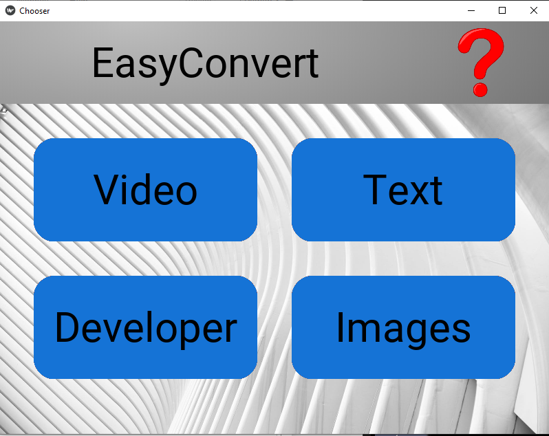
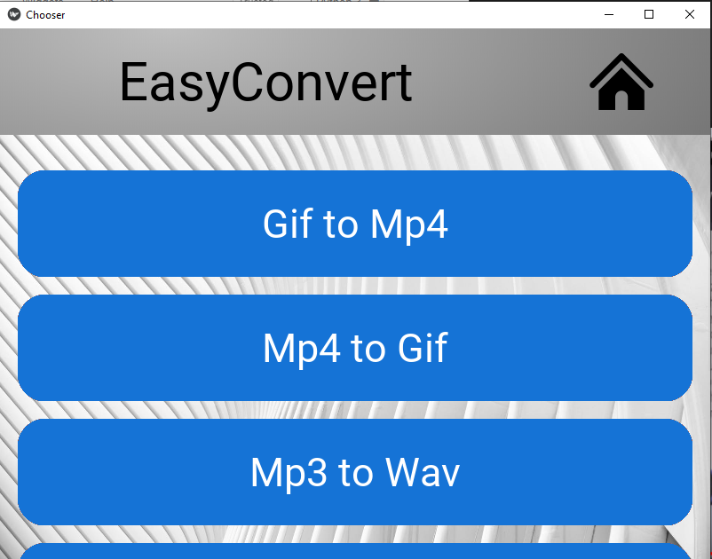

# EasyConvert

This repository contains the work of our Windows, Mac, Linux & Android application, Easy Convert. The app was a collaborative project built with Ali (aahmad4 on GitHub), Nico (nico-jimene on Github), and Aakash (aakosk on Github).
I was responsible for the app design, debugging, and android apk-building process.



# How To Use The App

To use the app simply select one of the buttons based on what file you currently have and what filetype you want it to become. Upon selection you will be prompted to your file dialog box on your respective device. Choose your current file and within seconds you will be prompted with a notification that your newly converted file is ready. The converions are simultaneous as well as efficient. 

## Installation

Use the package manager [pip](https://pip.pypa.io/en/stable/) to install the required packages.
```bash
pip install -r requirements.txt
```

## Usage
```
python main.py
```

## Contributing

Pull requests are welcome. For major changes, please open an issue first to discuss what you would like to change.

Please make sure to update tests as appropriate.


